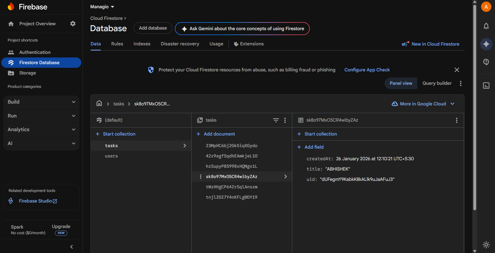
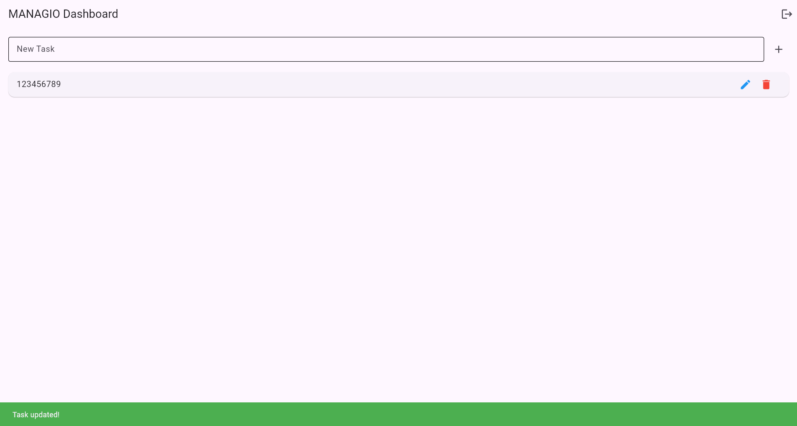
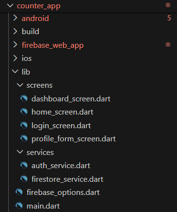

Managio – Firebase-Integrated Freelancer Task Management App

Managio is a Flutter-based task management application designed for freelancers to efficiently manage tasks using Firebase Authentication and Cloud Firestore.
This project demonstrates a complete Firebase setup including secure authentication, real-time database operations, and persistent user sessions.

🔥 Firebase Setup – Brief Overview

Firebase is used as the backend for Managio to handle:

Secure user authentication (Email & Password)

Real-time database operations using Cloud Firestore

Persistent login sessions without manual backend management

This setup removes the need for a traditional server while ensuring scalability and security.

📌 Sprint-2 Objective

Integrate Firebase Authentication and Cloud Firestore into a Flutter application to enable:

Secure user login and signup

Persistent authentication state

Real-time database CRUD operations

Scalable backend without a traditional server

🔐 Step-by-Step Implementation Guide
1️⃣ Firebase Project Setup

Created a Firebase project in Firebase Console

Added a Web App to the project

Enabled Email/Password Authentication

Enabled Cloud Firestore in test mode

2️⃣ Firebase Configuration in Flutter

Installed Firebase CLI and FlutterFire CLI, then ran:

flutterfire configure

Added required dependencies in pubspec.yaml and initialized Firebase in main.dart.

3️⃣ Authentication Implementation (Email & Password)
🔐 Signup
Future<User?> signUp(String email, String password) async {
  final credential = await FirebaseAuth.instance
      .createUserWithEmailAndPassword(
        email: email,
        password: password,
      );
  return credential.user;
}

🔐 Login
Future<User?> login(String email, String password) async {
  final credential = await FirebaseAuth.instance
      .signInWithEmailAndPassword(
        email: email,
        password: password,
      );
  return credential.user;
}

Firebase automatically manages:

Password hashing

Secure session tokens

Authentication state persistence

4️⃣ Firestore Database CRUD Operations

Each authenticated user can add, edit, delete, and view tasks stored under their user document.

➕ Add Record
Future<void> addTask(String uid, Map<String, dynamic> data) async {
  await FirebaseFirestore.instance
      .collection('users')
      .doc(uid)
      .collection('tasks')
      .add(data);
}

✏️ Update Record
Future<void> updateTask(String uid, String taskId, Map<String, dynamic> data) async {
  await FirebaseFirestore.instance
      .collection('users')
      .doc(uid)
      .collection('tasks')
      .doc(taskId)
      .update(data);
}

❌ Delete Record
Future<void> deleteTask(String uid, String taskId) async {
  await FirebaseFirestore.instance
      .collection('users')
      .doc(uid)
      .collection('tasks')
      .doc(taskId)
      .delete();
}

Firestore enables:

Real-time sync

Automatic UI updates

Secure, scalable data storage

🧩 Features Implemented

Unified Login / Signup Screen

Email & Password Authentication

Auth-based navigation flow

Firestore CRUD operations

Real-time database updates

Persistent user sessions

Clean service-based architecture

🛠️ Tech Stack

Flutter – UI framework

Firebase Core – Firebase initialization

Firebase Authentication – User management

Cloud Firestore – Real-time database

📸 Screenshots (Required)

Below screenshots demonstrate successful Firebase integration:

✅ Firebase Authentication → Users

✅ Cloud Firestore → Data

✅ Working Login & Signup Screen

✅ Add / Edit / Delete Firestore Records

✅ Project Folder Structure

🧠 Reflection
❓ Why is Firebase a popular choice for mobile backends?

Firebase provides ready-to-use services like authentication, real-time databases, and hosting without requiring backend server management. It automatically scales with user growth and integrates seamlessly with mobile frameworks like Flutter.

⚠️ Most Challenging Step in Setup

Firebase web configuration mismatches

Ensuring correct initialization order in Flutter

Handling authentication-based navigation

Understanding Firestore security rules

🚀 How This Integration Prepares the App for Future Features

This Firebase setup enables:

Easy addition of role-based access control

Real-time collaboration features

Secure user-specific data storage

Scalable backend for production-level apps

Firebase makes Managio ready for advanced authentication flows and complex database-driven features.

📂 Project Structure Overview

This project follows Flutter’s recommended folder structure for scalability and clean code organization.

Core app logic is inside the lib/ directory

Android and iOS builds are handled separately

Assets, tests, and configurations are well-organized

📄 Detailed Explanation

For a complete breakdown of each folder and file, refer to:

➡️ PROJECT_STRUCTURE.md

This document explains:

Purpose of each major folder

Flutter’s cross-platform build flow

Benefits of a well-structured Flutter project