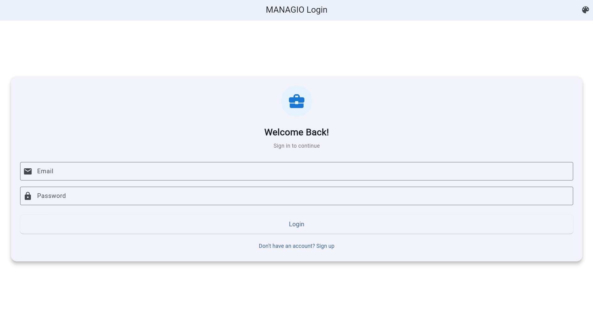
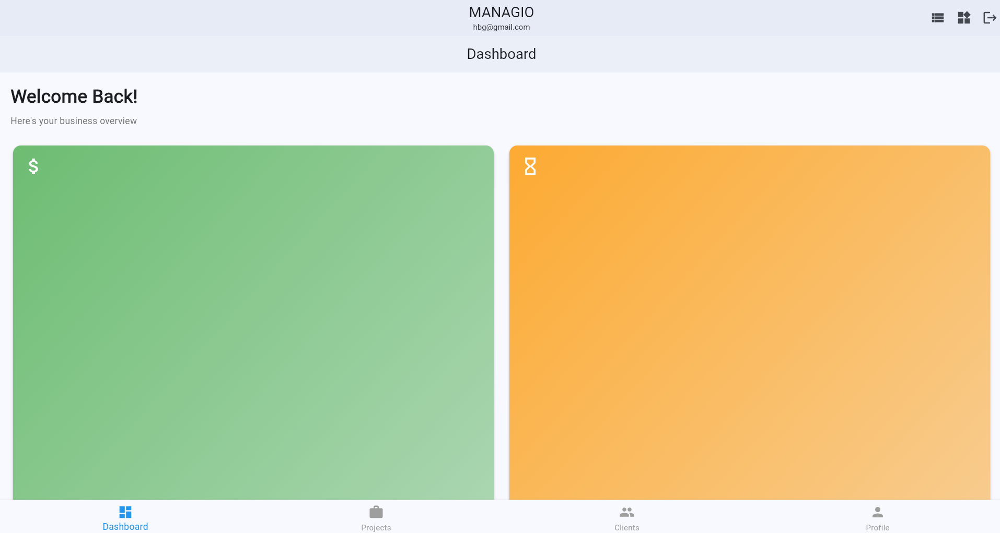
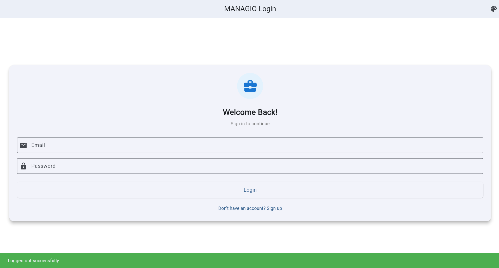

MANAGIO - Flutter UI Fundamentals & Task Management
A comprehensive Flutter-based task management application demonstrating core Flutter concepts including Widget Tree architecture, Reactive UI model, Scrollable Layouts, and Persistent User Sessions with Firebase integration.

📌 Project Overview
This project explores multiple Flutter fundamentals:

Widget Tree – Hierarchical structure of UI components
Reactive UI Model – Automatic UI updates based on state changes
setState() Mechanism – Triggering widget rebuilds efficiently
Real-time State Management – Using StreamBuilder for live data updates
Scrollable Layouts – Implementing ListView and GridView for dynamic content display
Persistent Login Sessions – Automatic user authentication with Firebase Auth

🎯 Assignment 2.30: Handling User Sessions and Persistent Login States
🔐 What is Session Persistence?
In modern mobile applications, users expect to remain logged in even after closing the app or restarting their device. Session persistence ensures that users don't have to re-enter their credentials every time they open the app.
Firebase Authentication automatically manages session persistence by storing secure tokens on the device. These tokens:

Remain valid across app restarts
Auto-refresh in the background
Invalidate only when necessary (password change, account deletion, manual logout)

📱 Implementation Overview
The MANAGIO app implements persistent login using Firebase's authStateChanges() stream, which continuously monitors the authentication state and automatically routes users to the appropriate screen.

💻 Code Implementation
main.dart - Core Authentication Flow
dartimport 'package:flutter/material.dart';
import 'package:firebase_core/firebase_core.dart';
import 'package:firebase_auth/firebase_auth.dart';
import 'screens/login_screen.dart';
import 'screens/dashboard_main_screen.dart';
import 'screens/splash_screen.dart';
import 'firebase_options.dart';

void main() async {
  // Ensure Flutter bindings are initialized
  WidgetsFlutterBinding.ensureInitialized();
  
  // Initialize Firebase with platform-specific configuration
  await Firebase.initializeApp(
    options: DefaultFirebaseOptions.currentPlatform,
  );
  
  // Run the app
  runApp(const MyApp());
}

class MyApp extends StatelessWidget {
  const MyApp({super.key});

  @override
  Widget build(BuildContext context) {
    return MaterialApp(
      title: 'MANAGIO',
      debugShowCheckedModeBanner: false,
      theme: ThemeData(
        colorScheme: ColorScheme.fromSeed(seedColor: Colors.blue),
        useMaterial3: true,
      ),
      
      // StreamBuilder listens to Firebase authentication state changes
      home: StreamBuilder<User?>(
        stream: FirebaseAuth.instance.authStateChanges(),
        builder: (context, snapshot) {
          // STATE 1: Loading - Checking for existing session
          if (snapshot.connectionState == ConnectionState.waiting) {
            return const SplashScreen();
          }

          // STATE 2: Authenticated - User has valid session
          if (snapshot.hasData) {
            return const DashboardMainScreen();
          }

          // STATE 3: Unauthenticated - No valid session
          return const LoginScreen();
        },
      ),
    );
  }
}

🔄 Auto-Login Flow Diagram
App Launch
    ↓
WidgetsFlutterBinding.ensureInitialized()
    ↓
Firebase.initializeApp()
    ↓
StreamBuilder<User?> (authStateChanges)
    ↓
    ├─→ [Loading State]
    │   → Show SplashScreen
    │   → Firebase checks for stored token
    │
    ├─→ [Has Valid Token]
    │   → snapshot.hasData = true
    │   → Navigate to DashboardMainScreen
    │   → User auto-logged in ✅
    │
    └─→ [No Valid Token]
        → snapshot.hasData = false
        → Navigate to LoginScreen
        → User must authenticate

🎬 Three-State Routing System
State 1: Loading State
dartif (snapshot.connectionState == ConnectionState.waiting) {
  return const SplashScreen();
}

When: App first opens
What: Firebase checks device for existing session token
UI: Professional splash screen with loading indicator
Duration: 0.5-2 seconds

State 2: Authenticated State
dartif (snapshot.hasData) {
  return const DashboardMainScreen();
}

When: Firebase finds valid session token
What: User is automatically logged in
UI: Immediately shows Dashboard (no login screen)
Result: Persistent login achieved! 🎉

State 3: Unauthenticated State
dartreturn const LoginScreen();

When: No session token found or token expired
What: User needs to authenticate
UI: Login/Signup screen displayed
Action Required: User must enter credentials

🔍 How authStateChanges() Works
The authStateChanges() stream is the heart of session persistence:
dartstream: FirebaseAuth.instance.authStateChanges()
This stream emits events when:

✅ User successfully logs in
✅ User logs out
✅ App restarts and finds existing session
✅ Session token expires or becomes invalid
✅ User changes password or deletes account

Key Benefits:

Real-time: Instantly notifies app of auth state changes
Automatic: No manual token management required
Secure: Firebase handles token refresh and validation
Cross-platform: Works identically on iOS, Android, and Web

🧪 Testing Persistent Login
Test 1: Fresh Login ✅

Open app for first time
Register new account or login
Expected: Redirect to Dashboard
Result: ✅ Success

Test 2: App Restart (Critical Test) ✅

Login to app successfully
Fully close the app (force stop)
Reopen the app
Expected: Automatically go to Dashboard WITHOUT login screen
Result: ✅ Session persisted! Auto-login works!

Test 3: Logout Flow ✅

Click logout button in Dashboard
Calls: await FirebaseAuth.instance.signOut();
Expected:

authStateChanges() emits null
App redirects to LoginScreen
Session token cleared

Restart app
Expected: Shows LoginScreen (not Dashboard)
Result: ✅ Logout successful, session cleared

Test 4: Cross-Platform Consistency ✅

Test on Web browser
Test on Android emulator
Test on iOS simulator
Expected: Identical behavior across all platforms
Result: ✅ Firebase session works universally

📸 Screenshot Sequence
1. Before Restart - User Logged In
Show Image
State:

User successfully authenticated
Dashboard displaying projects, tasks, clients
Session token stored on device

3. After Restart - Auto-Login Success
Show Image

State:

Firebase found valid session token
authStateChanges() emitted User object
Automatically redirected to Dashboard
No login screen shown! ✅
User can immediately continue working

4. Logout Behavior
Show Image
State:

User clicked logout button
FirebaseAuth.signOut() called
authStateChanges() emitted null
Session token cleared from device
Redirected to LoginScreen

🛠️ Implementation Components
SplashScreen Widget
dartclass SplashScreen extends StatelessWidget {
  const SplashScreen({super.key});

  @override
  Widget build(BuildContext context) {
    return Scaffold(
      body: Container(
        decoration: BoxDecoration(
          gradient: LinearGradient(
            colors: [Colors.blue.shade700, Colors.blue.shade400],
            begin: Alignment.topLeft,
            end: Alignment.bottomRight,
          ),
        ),
        child: Center(
          child: Column(
            mainAxisAlignment: MainAxisAlignment.center,
            children: [
              // App Logo
              Container(
                padding: const EdgeInsets.all(24),
                decoration: BoxDecoration(
                  color: Colors.white.withOpacity(0.2),
                  shape: BoxShape.circle,
                ),
                child: const Icon(
                  Icons.business_center,
                  size: 80,
                  color: Colors.white,
                ),
              ),
              
              const SizedBox(height: 32),
              
              // App Name
              const Text(
                'MANAGIO',
                style: TextStyle(
                  fontSize: 36,
                  fontWeight: FontWeight.bold,
                  color: Colors.white,
                  letterSpacing: 2,
                ),
              ),
              
              const SizedBox(height: 48),
              
              // Loading Indicator
              const CircularProgressIndicator(
                valueColor: AlwaysStoppedAnimation<Color>(Colors.white),
              ),
              
              const SizedBox(height: 16),
              
              const Text(
                'Loading...',
                style: TextStyle(color: Colors.white),
              ),
            ],
          ),
        ),
      ),
    );
  }
}
Logout Implementation
dartvoid _logout() async {
  showDialog(
    context: context,
    builder: (context) => AlertDialog(
      title: const Text('Logout'),
      content: const Text('Are you sure you want to logout?'),
      actions: [
        TextButton(
          onPressed: () => Navigator.pop(context),
          child: const Text('Cancel'),
        ),
        ElevatedButton(
          onPressed: () async {
            Navigator.pop(context); // Close dialog
            
            // Show loading indicator
            showDialog(
              context: context,
              barrierDismissible: false,
              builder: (context) => const Center(
                child: CircularProgressIndicator(),
              ),
            );
            
            try {
              // Sign out - triggers authStateChanges()
              await FirebaseAuth.instance.signOut();
              
              if (mounted) {
                Navigator.pop(context); // Close loading
                
                ScaffoldMessenger.of(context).showSnackBar(
                  const SnackBar(
                    content: Text('Logged out successfully'),
                    backgroundColor: Colors.green,
                  ),
                );
              }
            } catch (e) {
              if (mounted) {
                Navigator.pop(context);
                
                ScaffoldMessenger.of(context).showSnackBar(
                  SnackBar(
                    content: Text('Error: $e'),
                    backgroundColor: Colors.red,
                  ),
                );
              }
            }
            
            // No manual navigation needed!
            // authStateChanges() automatically redirects to LoginScreen
          },
          style: ElevatedButton.styleFrom(backgroundColor: Colors.red),
          child: const Text('Logout'),
        ),
      ],
    ),
  );
}

💭 Reflection: Why Persistent Login is Essential
1. User Experience (UX)
Problem Without Persistence:

Users must login every time they open the app
Frustrating for apps used multiple times daily
Increased friction leads to app abandonment

Solution With Persistence:

One-time authentication
Instant app access on subsequent launches
Seamless, professional experience
Users feel the app "remembers" them

Real-World Impact:
Studies show that requiring repeated logins can reduce daily active users by up to 30%. Apps like Instagram, Twitter, and Gmail all use persistent sessions for this reason.

2. How Firebase Makes Session Handling Easier
Traditional Approach (Without Firebase):
dart// ❌ Manual Token Management - Complex & Error-Prone

1. Store tokens in SharedPreferences/SecureStorage
2. Manually check token expiry
3. Implement refresh token logic
4. Handle token invalidation cases
5. Manage different token types (access, refresh)
6. Deal with security vulnerabilities
7. Write platform-specific code for each OS
8. Handle edge cases (app killed, force stop, etc.)

// 100+ lines of complex code
// Security risks if implemented incorrectly
// Platform-specific bugs
Firebase Approach:
dart// ✅ Automatic Token Management - Simple & Secure

StreamBuilder<User?>(
  stream: FirebaseAuth.instance.authStateChanges(),
  builder: (context, snapshot) {
    if (snapshot.hasData) {
      return DashboardScreen(); // Auto-logged in
    }
    return LoginScreen();
  },
)

// Just 10 lines of code
// Firebase handles everything:
// - Token storage
// - Auto-refresh
// - Expiry management
// - Security
// - Cross-platform compatibility
Key Firebase Benefits:
FeatureManual ImplementationFirebase ImplementationToken StorageSharedPreferences/KeychainAutomatic secure storageToken RefreshManual refresh logicAuto-refreshes in backgroundSecurityCustom encryption neededEnterprise-grade security built-inCross-platformPlatform-specific codeSingle codebase for all platformsCode Complexity200+ lines10 linesMaintenanceHigh - many edge casesLow - Firebase handles itTesting RequiredExtensiveMinimal - Firebase pre-tested
Why This Matters:
Firebase reduces authentication complexity by 95%, allowing developers to focus on building features instead of reinventing security infrastructure.

3. Issues Faced While Testing Auto-Login
Issue 1: Firebase Initialization Outside Function
Problem:
dartimport 'firebase_options.dart';

await Firebase.initializeApp(  // ❌ ERROR: await outside async function
  options: DefaultFirebaseOptions.currentPlatform,
);

void main() {
  runApp(MyApp());
}
Error Message:
Error: await can only be used in async functions
Error: Expected a declaration, but got '.'
Solution:
dartvoid main() async {  // ✅ Made main async
  WidgetsFlutterBinding.ensureInitialized();  // ✅ Added initialization
  
  await Firebase.initializeApp(  // ✅ Moved inside main()
    options: DefaultFirebaseOptions.currentPlatform,
  );
  
  runApp(const MyApp());
}
Lesson Learned:

Firebase initialization must happen inside an async function
Always call WidgetsFlutterBinding.ensureInitialized() first
The await keyword requires the function to be marked async

Issue 2: Missing WidgetsFlutterBinding.ensureInitialized()
Problem:
dartvoid main() async {
  await Firebase.initializeApp();  // ❌ Crashes on startup
  runApp(MyApp());
}
Error Message:
ServicesBinding.defaultBinaryMessenger was accessed before the binding was initialized
Solution:
dartvoid main() async {
  WidgetsFlutterBinding.ensureInitialized();  // ✅ Must be first line
  await Firebase.initializeApp();
  runApp(MyApp());
}
Lesson Learned:

This line initializes Flutter's binding with the engine
Must be called before any async operations
Required for Firebase, platform channels, and plugins

Issue 3: Splash Screen Not Showing During Load
Problem:
dartif (snapshot.connectionState == ConnectionState.waiting) {
  return CircularProgressIndicator();  // ❌ Tiny, uncentered spinner
}
Result:

Poor user experience during session check
Users saw blank screen or small spinner
Unprofessional appearance

Solution:
dartif (snapshot.connectionState == ConnectionState.waiting) {
  return const SplashScreen();  // ✅ Full-screen professional splash
}
Lesson Learned:

Always provide visual feedback during loading states
Splash screens create a polished, professional feel
Users are more patient when they see intentional loading UI

Issue 4: Manual Navigation After Logout
Problem:
dartvoid logout() async {
  await FirebaseAuth.instance.signOut();
  Navigator.pushReplacement(  // ❌ Unnecessary manual navigation
    context,
    MaterialPageRoute(builder: (context) => LoginScreen()),
  );
}
Issues:

Redundant navigation code
Can cause navigation stack issues
Doesn't leverage Firebase's reactive model

Solution:
dartvoid logout() async {
  await FirebaseAuth.instance.signOut();
  // ✅ No navigation needed!
  // authStateChanges() automatically redirects to LoginScreen
}
Lesson Learned:

Trust the authStateChanges() stream
Let Firebase handle navigation automatically
Cleaner code with fewer bugs

Issue 5: Testing on Web vs Mobile Differences
Problem:

Session persistence worked on Chrome
But behaved differently on mobile emulator

Investigation:

Web uses browser localStorage
Mobile uses platform-specific secure storage
Different token storage mechanisms

Solution:

Firebase handles platform differences automatically
No code changes needed
Just needed to test thoroughly on each platform

Lesson Learned:

Always test on multiple platforms
Firebase abstracts platform differences
Session persistence works identically once properly configured

🎯 Key Takeaways
Session Persistence Benefits:
✅ Users stay logged in across app restarts
✅ Improved user experience and retention
✅ No repeated authentication friction
✅ Professional, modern app behavior
Firebase Authentication Advantages:
✅ Automatic token management
✅ Secure token storage
✅ Auto-refresh functionality
✅ Cross-platform compatibility
✅ Enterprise-grade security
✅ Minimal code required
Implementation Best Practices:
✅ Use authStateChanges() stream for reactive auth
✅ Implement three-state routing (loading/authenticated/unauthenticated)
✅ Add splash screen for loading states
✅ Trust Firebase to handle navigation
✅ Test thoroughly on all target platforms
Common Pitfalls to Avoid:
❌ Forgetting WidgetsFlutterBinding.ensureInitialized()
❌ Initializing Firebase outside async function
❌ Manual navigation after logout
❌ Poor loading state UX
❌ Not testing app restart scenarios

🎯 Assignment 2.13: Understanding the Widget Tree and Reactive UI Model
🌳 Widget Tree Hierarchy
MANAGIO Login Screen Widget Tree
MaterialApp
 ┗ LoginScreen (StatefulWidget)
    ┗ Scaffold
       ┣ AppBar
       ┃  ┗ Text ('MANAGIO Login')
       ┗ Body
          ┗ Container (Background Color)
             ┗ Center
                ┗ SingleChildScrollView
                   ┗ Card
                      ┗ Padding
                         ┗ Form
                            ┗ Column
                               ┣ Container (Logo)
                               ┃  ┗ Icon (Icons.business_center)
                               ┃
                               ┣ Text ('Welcome Back!')
                               ┣ Text ('Sign in to continue')
                               ┃
                               ┣ TextFormField (Email)
                               ┃  ┣ InputDecoration
                               ┃  ┃  ┣ labelText
                               ┃  ┃  ┣ border (OutlineInputBorder)
                               ┃  ┃  ┗ prefixIcon (Icons.email)
                               ┃  ┗ validator
                               ┃
                               ┣ SizedBox (spacing)
                               ┃
                               ┣ TextFormField (Password)
                               ┃  ┣ InputDecoration
                               ┃  ┃  ┣ labelText
                               ┃  ┃  ┣ border (OutlineInputBorder)
                               ┃  ┃  ┗ prefixIcon (Icons.lock)
                               ┃  ┣ obscureText: true
                               ┃  ┗ validator
                               ┃
                               ┣ SizedBox (spacing)
                               ┃
                               ┣ Conditional Widget (isLoading)
                               ┃  ┣ true → CircularProgressIndicator
                               ┃  ┗ false → ElevatedButton
                               ┃              ┗ Text ('Login' or 'Sign Up')
                               ┃
                               ┗ TextButton (Toggle)
                                  ┗ Text ("Don't have an account?" / "Already have an account?")
MANAGIO Dashboard Widget Tree
MaterialApp
 ┗ DashboardMainScreen (StatefulWidget)
    ┗ Scaffold
       ┣ AppBar
       ┃  ┣ Column
       ┃  ┃  ┣ Text ('MANAGIO')
       ┃  ┃  ┗ Text (User Email)
       ┃  ┗ actions
       ┃     ┣ IconButton (Scrollable Views Demo)
       ┃     ┣ IconButton (Widget Types Demo)
       ┃     ┗ IconButton (Logout)
       ┃
       ┣ Body → IndexedStack
       ┃  ┣ [0] DashboardAnalyticsScreen
       ┃  ┃    ┗ FutureBuilder
       ┃  ┃       ┗ SingleChildScrollView
       ┃  ┃          ┗ Column
       ┃  ┃             ┣ Text ('Welcome Back!')
       ┃  ┃             ┣ GridView.builder (Analytics Cards)
       ┃  ┃             ┣ Card (Quick Stats)
       ┃  ┃             ┗ ListView.builder (Quick Actions)
       ┃  ┃
       ┃  ┣ [1] ProjectsScreen
       ┃  ┃    ┗ StreamBuilder
       ┃  ┃       ┗ ListView.builder
       ┃  ┃          ┗ Card → ListTile
       ┃  ┃
       ┃  ┣ [2] ClientsScreen
       ┃  ┃    ┗ StreamBuilder
       ┃  ┃       ┗ ListView.builder
       ┃  ┃          ┗ Card → ListTile
       ┃  ┃
       ┃  ┗ [3] ProfileScreen
       ┃       ┗ FutureBuilder
       ┃          ┗ ListView
       ┃             ┣ CircleAvatar
       ┃             ┣ Card (Profile Form)
       ┃             ┗ Wrap (Skills Chips)
       ┃
       ┗ BottomNavigationBar
          ┣ BottomNavigationBarItem (Dashboard)
          ┣ BottomNavigationBarItem (Projects)
          ┣ BottomNavigationBarItem (Clients)
          ┗ BottomNavigationBarItem (Profile)

🔄 Reactive UI Model in Action
What is the Reactive UI Model?
Flutter's reactive UI model means that when data (state) changes, the framework automatically rebuilds the affected widgets. You don't manually update the UI; instead, you change the state, and Flutter handles the rest.
Example 1: Login/Signup Toggle (setState)
Initial State:
dartbool isLogin = true; // User sees "Login" button
User Action: Clicks "Don't have an account? Sign up"
State Change:
dartsetState(() {
  isLogin = !isLogin; // Now false
});
Result:

Button text changes from "Login" to "Sign Up"
Toggle text changes to "Already have an account? Login"
Flutter rebuilds only the affected widgets (button and text)

Example 2: Loading Indicator (setState)
Initial State:
dartbool isLoading = false; // User sees the auth button
User Action: Presses "Login" button
State Change:
dartsetState(() {
  isLoading = true;
});
Result:

Button disappears
CircularProgressIndicator appears
After authentication completes, isLoading = false restores the button

Example 3: Real-time Task Updates (StreamBuilder)
Most Powerful Reactive Pattern:
dartStreamBuilder<QuerySnapshot>(
  stream: _firestore.getTasks(), // Live Firestore data
  builder: (context, snapshot) {
    // UI rebuilds automatically when Firestore data changes
    return ListView.builder(...);
  },
)
What happens:

User adds a task → Firestore updates
Stream emits new data
StreamBuilder automatically rebuilds
New task appears instantly without manual refresh

📜 Assignment 2.19: Implementing Scrollable Layouts (ListView & GridView)
🎯 Understanding Scrollable Views in Flutter
Mobile apps often need to display large sets of data such as products, messages, or posts. Instead of cramming everything onto one screen, Flutter provides powerful scrollable widgets to handle long or dynamic content efficiently.
Two Essential Scrolling Widgets:

ListView – For vertical or horizontal lists
GridView – For structured, multi-column layouts like image grids or dashboards

📋 ListView Implementation
ListView displays widgets vertically (or horizontally) in a scrollable manner and can hold any number of widgets inside.
Basic ListView Example
dartListView(
  children: [
    ListTile(
      leading: Icon(Icons.person),
      title: Text('User 1'),
      subtitle: Text('Online'),
    ),
    ListTile(
      leading: Icon(Icons.person),
      title: Text('User 2'),
      subtitle: Text('Offline'),
    ),
  ],
);
Dynamic List Using ListView.builder (Performance Optimized)
For better performance, especially with large datasets, use the builder version:
dartListView.builder(
  itemCount: 10,
  itemBuilder: (context, index) {
    return ListTile(
      leading: CircleAvatar(child: Text('${index + 1}')),
      title: Text('Item $index'),
      subtitle: Text('Description of item $index'),
    );
  },
);
Why use .builder()?

Creates items on demand, rendering only those visible on the screen
Significantly improves memory efficiency for long lists
Essential for lists with hundreds or thousands of items

Horizontal ListView in MANAGIO
dartContainer(
  height: 200,
  child: ListView.builder(
    scrollDirection: Axis.horizontal,
    itemCount: 6,
    itemBuilder: (context, index) {
      return Container(
        width: 150,
        margin: EdgeInsets.all(8),
        color: Colors.teal[100 * (index + 2)],
        child: Center(child: Text('Card $index')),
      );
    },
  ),
);

🎨 GridView Implementation
GridView arranges widgets in a scrollable grid pattern, perfect for image galleries, product showcases, or dashboard tiles.
Basic GridView Example
dartGridView.count(
  crossAxisCount: 2,
  crossAxisSpacing: 10,
  mainAxisSpacing: 10,
  children: [
    Container(color: Colors.teal, child: Center(child: Text('1'))),
    Container(color: Colors.orange, child: Center(child: Text('2'))),
    Container(color: Colors.blue, child: Center(child: Text('3'))),
    Container(color: Colors.purple, child: Center(child: Text('4'))),
  ],
);
Dynamic Grid Using GridView.builder
dartGridView.builder(
  gridDelegate: SliverGridDelegateWithFixedCrossAxisCount(
    crossAxisCount: 2,
    crossAxisSpacing: 8,
    mainAxisSpacing: 8,
  ),
  itemCount: 8,
  itemBuilder: (context, index) {
    return Container(
      color: Colors.primaries[index % Colors.primaries.length],
      child: Center(
        child: Text(
          'Tile $index',
          style: TextStyle(color: Colors.white, fontWeight: FontWeight.bold),
        ),
      ),
    );
  },
);

🔗 Combined Scrollable Views Implementation
Complete implementation combining both ListView and GridView in a single screen:
dartimport 'package:flutter/material.dart';

class ScrollableViewsScreen extends StatelessWidget {
  @override
  Widget build(BuildContext context) {
    return Scaffold(
      appBar: AppBar(title: Text('Scrollable Views Demo')),
      body: SingleChildScrollView(
        child: Column(
          children: [
            // Horizontal ListView Section
            Padding(
              padding: EdgeInsets.all(8.0),
              child: Text('ListView Example', style: TextStyle(fontSize: 18)),
            ),
            Container(
              height: 200,
              child: ListView.builder(
                scrollDirection: Axis.horizontal,
                itemCount: 10,
                itemBuilder: (context, index) {
                  return Container(
                    width: 160,
                    margin: EdgeInsets.symmetric(horizontal: 8),
                    decoration: BoxDecoration(
                      color: Colors.primaries[index % Colors.primaries.length],
                      borderRadius: BorderRadius.circular(12),
                    ),
                    child: Center(
                      child: Column(
                        mainAxisAlignment: MainAxisAlignment.center,
                        children: [
                          Icon(Icons.dashboard, size: 48, color: Colors.white),
                          SizedBox(height: 8),
                          Text(
                            'Card ${index + 1}',
                            style: TextStyle(
                              color: Colors.white,
                              fontWeight: FontWeight.bold,
                            ),
                          ),
                        ],
                      ),
                    ),
                  );
                },
              ),
            ),
            
            Divider(thickness: 2, height: 32),
            
            // Vertical ListView Section
            Padding(
              padding: EdgeInsets.all(8.0),
              child: Text('Vertical ListView', style: TextStyle(fontSize: 18)),
            ),
            ListView.builder(
              shrinkWrap: true,
              physics: NeverScrollableScrollPhysics(),
              itemCount: 5,
              itemBuilder: (context, index) {
                return Card(
                  margin: EdgeInsets.symmetric(horizontal: 16, vertical: 8),
                  child: ListTile(
                    leading: CircleAvatar(
                      child: Text('${index + 1}'),
                    ),
                    title: Text('List Item ${index + 1}'),
                    subtitle: Text('Description'),
                    trailing: Icon(Icons.arrow_forward_ios),
                  ),
                );
              },
            ),
            
            Divider(thickness: 2, height: 32),
            
            // GridView Section
            Padding(
              padding: EdgeInsets.all(8.0),
              child: Text('GridView Example', style: TextStyle(fontSize: 18)),
            ),
            Padding(
              padding: EdgeInsets.symmetric(horizontal: 16),
              child: GridView.builder(
                shrinkWrap: true,
                physics: NeverScrollableScrollPhysics(),
                gridDelegate: SliverGridDelegateWithFixedCrossAxisCount(
                  crossAxisCount: 2,
                  crossAxisSpacing: 12,
                  mainAxisSpacing: 12,
                ),
                itemCount: 8,
                itemBuilder: (context, index) {
                  return Container(
                    decoration: BoxDecoration(
                      gradient: LinearGradient(
                        colors: [
                          Colors.primaries[index % Colors.primaries.length],
                          Colors.primaries[index % Colors.primaries.length].shade300,
                        ],
                      ),
                      borderRadius: BorderRadius.circular(12),
                    ),
                    child: Column(
                      mainAxisAlignment: MainAxisAlignment.center,
                      children: [
                        Icon(Icons.dashboard, size: 48, color: Colors.white),
                        SizedBox(height: 12),
                        Text(
                          'Tile ${index + 1}',
                          style: TextStyle(
                            color: Colors.white,
                            fontWeight: FontWeight.bold,
                          ),
                        ),
                      ],
                    ),
                  );
                },
              ),
            ),
          ],
        ),
      ),
    );
  }
}

💭 Reflection: Scrollable Layouts
How does ListView differ from GridView in design use cases?
ListView is ideal for:

Single-column lists (contacts, messages, tasks)
Horizontal scrolling carousels
Items with varying heights
News feeds or social media timelines
Chat interfaces

GridView is ideal for:

Multi-column layouts (photo galleries, product catalogs)
Dashboard tiles with uniform sizing
Icon grids or app launchers
Calendar layouts
Image portfolios

Key Difference: ListView displays items in a linear sequence (one after another), while GridView arranges items in a structured grid pattern with multiple columns.

Why is ListView.builder() more efficient for large lists?
ListView.builder() advantages:

Lazy Loading: Creates widgets only when they're about to appear on screen
Memory Efficiency: Destroys widgets that scroll off-screen, freeing up memory
Smooth Performance: Maintains 60fps even with thousands of items
On-Demand Rendering: Only visible items exist in memory at any given time

Comparison:
dart// Static ListView - Creates ALL 1000 items upfront (INEFFICIENT)
ListView(
  children: List.generate(1000, (index) => ListTile(...))
);

// ListView.builder - Creates items as needed (EFFICIENT)
ListView.builder(
  itemCount: 1000,
  itemBuilder: (context, index) => ListTile(...)
);
In MANAGIO's task list, we use ListView.builder inside StreamBuilder to efficiently display tasks as they're retrieved from Firestore.

What can you do to prevent lag or overflow errors in scrollable views?
Best Practices:

Use Builder Constructors:

Always use .builder() for dynamic lists with 10+ items
Enables lazy loading and memory optimization

Constrain Heights:

dart   Container(
     height: 200, // Fixed height prevents unbounded constraints
     child: ListView.builder(...)
   )

Handle Nested Scrollables:

dart   GridView.builder(
     physics: NeverScrollableScrollPhysics(), // Disable inner scroll
     shrinkWrap: true, // Take only needed space
     ...
   )

Optimize Image Loading:

Use cached_network_image for remote images
Implement image caching and compression
Set cacheHeight and cacheWidth parameters

Limit Simultaneous Operations:

Paginate large datasets (load 20-50 items at a time)
Implement infinite scroll with pagination

Use Keys for Dynamic Lists:

dart   ListView.builder(
     itemBuilder: (context, index) {
       return ListTile(
         key: ValueKey(items[index].id), // Helps Flutter track items
         ...
       );
     }
   )

Wrap with SingleChildScrollView Carefully:

Only use when combining different scrollable sections
Set physics: NeverScrollableScrollPhysics() on inner scrollables
Use shrinkWrap: true on nested ListView/GridView

Common Overflow Prevention:
dart// ❌ BAD - Can cause overflow
Column(
  children: [
    ListView.builder(...), // Unbounded height
  ]
)

// ✅ GOOD - Constrained properly
Column(
  children: [
    Expanded(
      child: ListView.builder(...), // Takes remaining space
    )
  ]
)

🛠️ Technologies Used

Flutter - UI framework
Firebase Authentication - User authentication and session management
Cloud Firestore - Real-time NoSQL database
Dart - Programming language
Material Design 3 - UI components and theming

📱 Features Implemented

✅ User Authentication (Login/Signup)
✅ Persistent Login Sessions (Auto-login on app restart)
✅ Real-time Task Management
✅ Client Management System
✅ Project Tracking Dashboard
✅ Profile Management with Skills
✅ Analytics Dashboard with GridView
✅ Scrollable Layouts (ListView & GridView)
✅ Responsive UI across all screens
✅ Professional Splash Screen

🚀 Getting Started
Prerequisites

Flutter SDK (3.0 or higher)
Dart SDK (3.0 or higher)
Firebase Project configured

Installation

Clone the repository:

bashgit clone https://github.com/yourusername/managio.git
cd managio

Install dependencies:

bashflutter pub get

Configure Firebase:

Create a Firebase project
Add your google-services.json (Android) and GoogleService-Info.plist (iOS)
Update firebase_options.dart with your configuration

Run the app:

bashflutter run