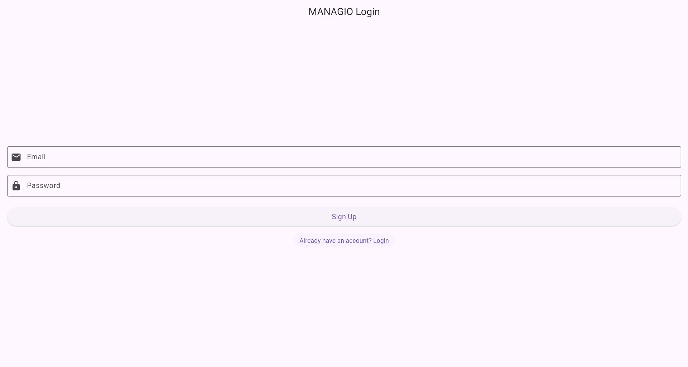

# MANAGIO - Widget Tree & Reactive UI Demonstration

A Flutter-based task management application that demonstrates Flutter's widget tree architecture and reactive UI model through real-time task management with Firebase integration.

## 📌 Assignment 2.13 Overview

This project explores Flutter's core concepts:
- **Widget Tree** – Hierarchical structure of UI components
- **Reactive UI Model** – Automatic UI updates based on state changes
- **setState() Mechanism** – Triggering widget rebuilds efficiently
- **Real-time State Management** – Using StreamBuilder for live data updates

---

## 🌳 Widget Tree Hierarchy

### MANAGIO Login Screen Widget Tree
```
MaterialApp
 ┗ LoginScreen (StatefulWidget)
    ┗ Scaffold
       ┣ AppBar
       ┃  ┗ Text ('MANAGIO Login')
       ┗ Body
          ┗ Padding
             ┗ Form
                ┗ Column
                   ┣ TextFormField (Email)
                   ┃  ┣ InputDecoration
                   ┃  ┃  ┣ labelText
                   ┃  ┃  ┣ border (OutlineInputBorder)
                   ┃  ┃  ┗ prefixIcon (Icons.email)
                   ┃  ┗ validator
                   ┃
                   ┣ SizedBox (spacing)
                   ┃
                   ┣ TextFormField (Password)
                   ┃  ┣ InputDecoration
                   ┃  ┃  ┣ labelText
                   ┃  ┃  ┣ border (OutlineInputBorder)
                   ┃  ┃  ┗ prefixIcon (Icons.lock)
                   ┃  ┣ obscureText: true
                   ┃  ┗ validator
                   ┃
                   ┣ SizedBox (spacing)
                   ┃
                   ┣ Conditional Widget (isLoading)
                   ┃  ┣ true → CircularProgressIndicator
                   ┃  ┗ false → ElevatedButton
                   ┃              ┗ Text ('Login' or 'Sign Up')
                   ┃
                   ┗ TextButton (Toggle)
                      ┗ Text ("Don't have an account?" / "Already have an account?")
```

### MANAGIO Dashboard Widget Tree
```
MaterialApp
 ┗ DashboardScreen (StatefulWidget)
    ┗ Scaffold
       ┣ AppBar
       ┃  ┣ Text ('MANAGIO Dashboard')
       ┃  ┗ actions
       ┃     ┗ IconButton (Logout)
       ┃        ┗ Icon (Icons.logout)
       ┃
       ┗ Body
          ┗ Column
             ┣ Padding (Input Section)
             ┃  ┗ Row
             ┃     ┣ Expanded
             ┃     ┃  ┗ TextField
             ┃     ┃     ┗ InputDecoration
             ┃     ┗ IconButton (Add)
             ┃        ┗ Icon (Icons.add)
             ┃
             ┗ Expanded (Task List)
                ┗ StreamBuilder<QuerySnapshot>
                   ┗ ListView.builder
                      ┗ Card
                         ┗ ListTile
                            ┣ title (Text - Task Title)
                            ┗ trailing
                               ┗ Row
                                  ┣ IconButton (Edit)
                                  ┃  ┗ Icon (Icons.edit)
                                  ┗ IconButton (Delete)
                                     ┗ Icon (Icons.delete)
```

---

## 🔄 Reactive UI Model in Action

### What is the Reactive UI Model?

Flutter's reactive UI model means that **when data (state) changes, the framework automatically rebuilds the affected widgets**. You don't manually update the UI; instead, you change the state, and Flutter handles the rest.

### Example 1: Login/Signup Toggle (setState)

**Initial State:**
```dart
bool isLogin = true; // User sees "Login" button
```

**User Action:** Clicks "Don't have an account? Sign up"

**State Change:**
```dart
setState(() {
  isLogin = !isLogin; // Now false
});
```

**Result:** 
- Button text changes from "Login" to "Sign Up"
- Toggle text changes to "Already have an account? Login"
- Flutter rebuilds only the affected widgets (button and text)

### Example 2: Loading Indicator (setState)

**Initial State:**
```dart
bool isLoading = false; // User sees the auth button
```

**User Action:** Presses "Login" button

**State Change:**
```dart
setState(() {
  isLoading = true;
});
```

**Result:**
- Button disappears
- CircularProgressIndicator appears
- After authentication completes, `isLoading = false` restores the button

### Example 3: Real-time Task Updates (StreamBuilder)

**Most Powerful Reactive Pattern:**
```dart
StreamBuilder<QuerySnapshot>(
  stream: _firestore.getTasks(), // Live Firestore data
  builder: (context, snapshot) {
    // UI rebuilds automatically when Firestore data changes
    return ListView.builder(...);
  },
)
```

**What happens:**
1. User adds a task → Firestore updates
2. Stream emits new data
3. StreamBuilder automatically rebuilds
4. New task appears instantly without manual refresh

---

## 📸 Visual State Changes

### Before State Change (Login Mode)


**State:**
- `isLogin = true`
- Button shows "Login"
- Toggle shows "Don't have an account? Sign up"
- `isLoading = false`

---

### After State Change (Signup Mode)


**State:**
- `isLogin = false` (after clicking toggle)
- Button shows "Sign Up"
- Toggle shows "Already have an account? Login"
- Same UI elements, different content

---

### Loading State


**State:**
- `isLoading = true` (during authentication)
- Button replaced by CircularProgressIndicator
- User cannot submit duplicate requests

---

### Dashboard - Empty State


**State:**
- Firestore stream returns empty list
- Shows "No tasks yet!" message
- Conditional rendering based on `snapshot.data.docs.isEmpty`

---

### Dashboard - With Tasks


**State:**
- Firestore stream returns task documents
- ListView.builder creates Card for each task
- Real-time updates when tasks are added/edited/deleted

---

## 🧠 Understanding Flutter's Reactive Model

### What is a Widget Tree?

The widget tree is a **hierarchical structure** where:
- Each widget is a node in the tree
- Parent widgets contain child widgets
- The root is typically `MaterialApp` or `CupertinoApp`
- Every visual element is a widget (buttons, text, containers, layouts)

**Example from MANAGIO:**
```
MaterialApp (root)
  └─ LoginScreen
      └─ Scaffold
          ├─ AppBar (child 1)
          └─ Body (child 2)
              └─ Form
                  └─ Column
                      ├─ TextFormField (child 1)
                      ├─ TextFormField (child 2)
                      └─ ElevatedButton (child 3)
```

---

### How Does the Reactive Model Work in Flutter?

Flutter uses a **declarative UI approach**:

1. **State Changes** → You modify variables in `setState()` or streams emit new data
2. **Framework Notification** → Flutter knows widgets need updating
3. **Widget Rebuild** → `build()` method is called again
4. **Efficient Update** → Only changed widgets are re-rendered

**Code Example:**
```dart
// State variable
bool isLogin = true;

// User interaction triggers state change
TextButton(
  onPressed: () {
    setState(() {
      isLogin = !isLogin; // State changes
    });
  },
  // Build method uses the state
  child: Text(
    isLogin
        ? "Don't have an account? Sign up"
        : "Already have an account? Login",
  ),
)
```

**What happens:**
1. User taps TextButton
2. `setState()` marks widget as dirty
3. Flutter calls `build()` again
4. New `Text` widget created with updated string
5. Only this Text widget re-renders (not entire screen)

---

### Why Does Flutter Rebuild Only Parts of the Tree?

Flutter uses **three separate trees** for optimization:

#### 1. Widget Tree (Immutable Configuration)
- Created by your code
- Rebuilt frequently (cheap to create)
- Describes what the UI should look like

#### 2. Element Tree (Persistent State Holder)
- Manages state and lifecycle
- Stays alive between rebuilds
- Knows which widgets changed

#### 3. Render Tree (Actual Drawing)
- Handles layout, painting, compositing
- Only updates when Element tree says something changed

**Optimization Process:**
```dart
// Old widget tree
Text('Count: 0')

// State changes: count = 1
setState(() { count++; })

// New widget tree
Text('Count: 1')

// Flutter compares:
// - Old Text widget vs New Text widget
// - Only the text content changed
// - Element tree keeps the same Text element
// - Render tree repaints just that Text area
```

**Why This Matters:**

✅ **Performance:** Only changed widgets rebuild  
✅ **Efficiency:** Element tree reuses components  
✅ **Smooth UI:** Minimal re-rendering = 60fps animations  
✅ **Battery Life:** Less CPU usage  

**In MANAGIO:**
- When you toggle login/signup, only the button text and toggle text rebuild
- When tasks update via StreamBuilder, only the ListView rebuilds
- When loading indicator appears, only that section of the Column changes
- The AppBar, Scaffold, and other widgets stay untouched

---

## 💡 Key Takeaways

### Widget Tree Principles
1. Everything in Flutter is a widget
2. Widgets form parent-child relationships
3. Deep nesting creates the hierarchical tree structure
4. Changes propagate down from parent to child

### Reactive UI Benefits
1. **Automatic Updates:** No manual DOM manipulation
2. **Clean Code:** Declare what UI should look like, not how to update it
3. **Predictable:** State → UI relationship is always clear
4. **Testable:** Easy to verify UI matches state

### State Management in MANAGIO
- **Local State:** `setState()` for login/signup toggle, loading indicator
- **Stream State:** `StreamBuilder` for real-time Firestore tasks
- **Global State:** `FirebaseAuth.instance.currentUser` for session

---

## 🛠️ Code Examples

### setState() Pattern
```dart
class _LoginScreenState extends State<LoginScreen> {
  bool isLogin = true;
  bool isLoading = false;

  // Reactive state update
  void toggleMode() {
    setState(() {
      isLogin = !isLogin; // UI rebuilds automatically
    });
  }

  @override
  Widget build(BuildContext context) {
    // Build method called every time setState() runs
    return ElevatedButton(
      onPressed: toggleMode,
      child: Text(isLogin ? 'Login' : 'Sign Up'),
    );
  }
}
```

### StreamBuilder Pattern
```dart
StreamBuilder<QuerySnapshot>(
  stream: FirebaseFirestore.instance
      .collection('tasks')
      .where('uid', isEqualTo: currentUser.uid)
      .snapshots(), // Live stream
  builder: (context, snapshot) {
    // Rebuilds automatically when Firestore data changes
    if (snapshot.connectionState == ConnectionState.waiting) {
      return CircularProgressIndicator();
    }
    
    if (snapshot.hasError) {
      return Text('Error: ${snapshot.error}');
    }
    
    if (!snapshot.hasData || snapshot.data!.docs.isEmpty) {
      return Text('No tasks yet!');
    }
    
    // UI reflects current database state
    return ListView.builder(
      itemCount: snapshot.data!.docs.length,
      itemBuilder: (ctx, index) {
        final task = snapshot.data!.docs[index];
        return ListTile(title: Text(task['title']));
      },
    );
  },
)
```

---

## 🎯 Practical Applications in MANAGIO

| Feature | State Type | Reactive Mechanism |
|---------|-----------|-------------------|
| Login/Signup Toggle | Local State | `setState()` |
| Loading Indicator | Local State | `setState()` |
| Task List Display | Stream State | `StreamBuilder` |
| Add Task | Firestore Write | Triggers stream update |
| Edit Task | Firestore Update | StreamBuilder auto-rebuilds |
| Delete Task | Firestore Delete | StreamBuilder removes from UI |
| Auth Status | Global State | Navigation based on `currentUser` |

---

## 📚 Additional Resources

- [Flutter Widget Tree Documentation](https://docs.flutter.dev/ui/layout)
- [State Management Guide](https://docs.flutter.dev/data-and-backend/state-mgmt/intro)
- [StreamBuilder API](https://api.flutter.dev/flutter/widgets/StreamBuilder-class.html)

---

**Team:** The Wolf  
**Sprint:** 2 - Widget Tree & Reactive UI Understanding  
**Assignment:** 2.13 - Understanding the Widget Tree and Flutter's Reactive UI Model